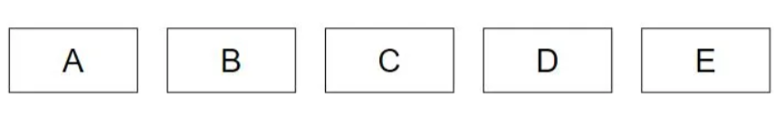
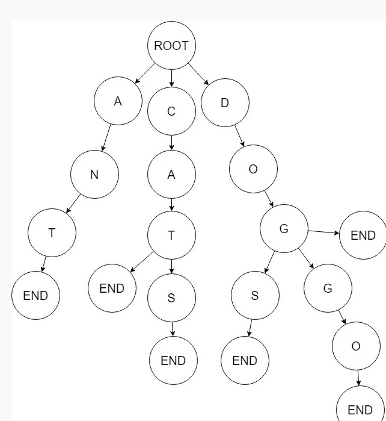

### Implementing Merkle Tree and Patricia Trie

## Introduction
Merkle and Patricia are the two most popular data structures used in the Ethereum Blockchain with Bloom Filters very close behind it. This project covers the following:

- About Merkel Trees and Patricia Tries
- Algorithm
- Implementation in Node.js

## Merkel Trees
Merkel Tree isn’t a new concept in Computer Science, it has been around for decades and originates from the field of Cryptography.

To simply put, Merkel Trees are essentially a tree data structure in which data is stored in the leaf nodes and non leaf nodes store hashes of data with each non-leaf node being the combined hash value of the two nodes below it.

Mathematically, it can be expressed as

                node = hash ∑ (node.children(i).hash)

The bottom most layer of the tree would contain all the letters as the leaf nodes.

The nodes in the layer after the second layer are contains the hash value of the child nodes. Generally we take two nodes from the second layer and combine them to form another node. We can take more than two nodes as well but binary merkel trees is the simplest of them all and increasing the degree of nodes only increase the computation and algorithms complexity.

If we have even number of nodes, we take 2 consecutive nodes and form the parent layer. But if we have odd number of nodes, we take two consecutive nodes until one is left to form the parent layer, and then we repeat the remaining node by copying the hash to the parent layer.

Similarly the fourth layer is formed using the values of the third layer and so on.

## Verification
The importance Merkel Trees is in its ability to verify data with efficiency. Given any data from the list we can verify in O(h) time complexity that this data is valid or not.

# Suppose I received a data C from another server. Lets say this is C’. We want to verify C’

- Find the position of the C’ in the list. Probably by searching by id.
- Calculate the the hash of C’
- Calculate the value of the parent node by hashing the current node with its neighbor ( next if position is odd and previous if position in even) and set the parent as the current node.
- Repeat step 3 until we find the root
- Compare the root with the previous root, if they match then C’

### Patricia Tries
Patricia Tries are n-ary trees which unlike Merkel Trees,is used for storage of data instead of verification.

To simply put, Patricia Tries is a tree data structure in which all the data is store in the leaf nodes, where each non-leaf nodes is a character of a unique string identifying the data. Using the unique string we navigate through the character nodes and finally reach the data.

Patricia Trie is like a hash table but with a few subtle differences.

Lets take a look at an example. Consider the following words:

Cat, Cats, Car, Dog, Dogs, Doggo, Ant

A patricia trie storing these items will look like this:

The node with value END denotes that the path traversed till now is actually a word. Those nodes that do not have END child node denotes that the word is not present.

For example, in the diagram above, the word ANT is present in the trie because of the END node after “T”. Similarly, for CATS the END node is present after S which makes it a word in the trie. Interestingly, if we put an END node before like for CAT, we’ll have two words store in the same path but we can access the CAT by not traversing all the way to the bottom and checking if END exists anywhere between.

So is the case with DOG,DOGS and DOGGO. For DOG we will have only one returned value since it has it has the END node. But if we search the patricia with DOG as a prefix we will get three returned values. That is basically, depth first search used here.

Ethereum uses Patricia tries for storing transactions in blocks, transaction receipts and maintaining state of the network.

## Algorithm

Each node in the trie, we can say, is itself a hash table which hash a character as the key and another hash table as the value. All operations, insertion, deletion and access take O(h) where h is the length of hash or depth of the tree in our case.

By using this definition, we can write the following algorithm for storing data in the trie:

        curr <- {}
        for each char in data.hash:
            if curr[char] is null:
                curr[char] <- {}
            curr <- curr[char]
        curr["DATA"] <- data
In this algorithm we create an empty key-value pair object, traverse the entire length of the hash and for each character set the value as a new empyt key-value pair object. Also for each charater we set the curr mapping to the next mapping. And finally when we have created the entire branch, we set the data at the end with the last node key a label “DATA”.

While accessing we return the value of the last mapping for the key “DATA” and in deletion we just delete the leaf node for the given hash.

# Special Mention
Thanks to @[kashishkhullar](https://github.com/kashishkhullar) Blog on Medium on this topic.
